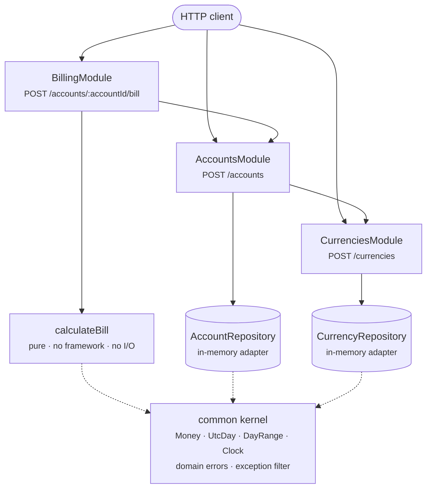

<p align="center">
<picture>
    <source media="(prefers-color-scheme: dark)" srcset="docs/assets/bcb-group-white.svg">
    
</picture>
</p>

# BCB Billing Service

Billing looks like a simple problem until you start writing the tests for it. This service works out
what an account owes in GBP and it does so with three rules: a monthly base fee, a fee for every
transaction above a monthly threshold, and a percentage discount which runs for a set number of days
after the account is created.

The brief says a database is not required so everything lives in memory. Every repository still sits
behind an interface though, which means swapping in a real database is a one line change per module.

One thing to know before you run anything. A billing period includes its start day and stops before
its end day, so `2026-01-01` to `2026-02-01` is exactly one month. I explain that properly under
[how a bill is calculated](#how-a-bill-is-calculated), and it is worth reading before you are
surprised by a figure.

If you want to know why things are built the way they are, the trade-offs I weighed up and what I
would do differently in production, that all lives in **[TRADEOFFS.md](TRADEOFFS.md)**.

Read more about the billing service:

- [Architecture](#architecture)
- [Running it](#running-it)
- [API](#api)
- [How a bill is calculated](#how-a-bill-is-calculated)
- [Assumptions](#assumptions)
- [Tests](#tests)
- [Configuration](#configuration)

## Architecture



<sub>Rendered copy: [docs/architecture-current.png](docs/architecture-current.png)</sub>


```
src/
  billing/       the bill endpoint, orchestration, and the calculation itself
    domain/      calculateBill, BillingPeriod, MonthFraction
  accounts/      account registration
  currencies/    tariff registration
  common/        Money, UtcDay, DayRange, Clock, domain errors, exception filter, validators
  config/        typed and validated environment configuration
```

Four decisions carry most of the weight here, and they are the four I would defend first.

**I kept the billing rules as a pure function.** `calculateBill` imports nothing from NestJS,
touches no I/O and cannot read the clock. Leap years, expired promotions, three year periods, you
can reach all of it from a unit test without HTTP and without a single mock.

**I made dependencies point one way only.** Billing leans on accounts and currencies and neither of
them leans back. Services are the public face of a module while repositories stay private to whoever
owns them, so persistence never becomes something the whole app shares.

**I kept HTTP out of the domain entirely.** Business rules throw typed domain errors which carry a
code. The exception filter is the only file in the project which imports `HttpStatus`, and its map
is declared `satisfies Record<DomainErrorCode, HttpStatus>`, so adding a code and forgetting to give
it a status breaks the build instead of returning a 500 nobody asked for.

**I never let money become a float.** Amounts are integer pence and month fractions build up as
integers scaled by `lcm(28, 29, 30, 31) = 377580`. Do it with floats and `31/31 + 3/30` gives you
`1.1`, but `100 × 1.1` is `110.00000000000001`, so `ceil` returns 111 and you have just handed out a
free transaction. There is a regression test pinning that exact period.

**Every request is logged, and every request can be traced.** A global interceptor writes one line
when the response finishes, carrying the method, the path, the status and how long it took, at error
level for a 5xx, warn for a 4xx and log otherwise. Each request also gets an id, which comes back on
the `x-request-id` header and appears in the error body, so a caller reporting a problem can quote
one string and I can find the exact line. If a gateway already sent an id I reuse it, but only after
checking it, because that value ends up in a log line and I am not going to let somebody forge one.
Request bodies are never logged, since they carry fees and account identifiers.

Three places use a try/catch, and only three. Starting the service, because a process which cannot
start has to say why and exit non-zero rather than sit there looking healthy. Writing an error
response, because an error raised after the response has begun cannot be answered with a second one.
And the logging itself, because logging must never be the reason a request fails. Everywhere else an
error is thrown as a typed domain error and the filter turns it into the envelope above, which is
why you will not find a try/catch in any service.

One smaller thing worth pointing out. The validation pipe and the exception filter are registered as
`APP_PIPE` and `APP_FILTER` providers rather than through `app.useGlobalPipes`, which means any test
which boots the application module gets production request handling for free.

## Running it

```bash
npm ci
npm run verify      # lint, typecheck, unit tests with coverage, e2e tests
npm run start:dev   # http://localhost:3000
```

Or if you would rather not install anything:

```bash
docker compose up --build
```

Either way the API documents itself at **http://localhost:3000/api/docs**, so you can poke at the
endpoints without writing a single curl command.

## API

| Method | Path | | Success |
| ------ | ---- | --- | ------- |
| `POST` | `/currencies` | Register a currency and its tariff | `201` |
| `POST` | `/accounts` | Open a customer account | `201` |
| `POST` | `/accounts/:accountId/bill` | Calculate a bill. Nothing is persisted | `200` |
| `GET` | `/health` | Liveness probe | `200` |

Start by registering a tariff. `transactionFeeGbp` is optional and falls back to the configured
default, so the two field payload from the brief works exactly as written:

```json
{ "currency": "USDT", "monthlyFeeGbp": 30, "transactionFeeGbp": 0.25 }
```

Then open an account against it:

```json
{
  "accountId": "acc-001",
  "currency": "USDT",
  "transactionThreshold": 100,
  "discountDays": 45,
  "discountRate": 10
}
```

And bill it:

```json
{ "billingPeriodStart": "2026-01-01", "billingPeriodEnd": "2026-03-01", "transactionCount": 500 }
```

The response below is the bill for an account opened on `2026-01-01`, which is the scenario pinned
in `test/billing.e2e-spec.ts`. Run the same request against a live service today and the discount
comes back as zero, because your account was opened today and the promotion never reaches January.
There is a copy-pasteable run further down which does show a discount.

You will notice every amount comes back twice. `minorUnits` is the real number in pence and it is
the one which adds up, while `amount` is there for you to display. The `details` block is included
so you can check a bill by hand without opening a single source file.

```json
{
  "accountId": "acc-001",
  "accountCurrency": "USDT",
  "billingCurrency": "GBP",
  "billingPeriod": { "start": "2026-01-01", "end": "2026-03-01", "days": 59, "months": 2 },
  "breakdown": {
    "baseFee": { "minorUnits": 6000, "amount": "60.00" },
    "transactionFees": { "minorUnits": 7500, "amount": "75.00" },
    "subtotal": { "minorUnits": 13500, "amount": "135.00" },
    "discount": { "minorUnits": 1030, "amount": "10.30" }
  },
  "total": { "minorUnits": 12470, "amount": "124.70" },
  "details": {
    "monthlyFee": { "minorUnits": 3000, "amount": "30.00" },
    "transactionFee": { "minorUnits": 25, "amount": "0.25" },
    "transactionCount": 500,
    "transactionThreshold": 100,
    "effectiveThreshold": 200,
    "chargeableTransactions": 300,
    "discountRatePercent": 10,
    "discountDays": 45,
    "discountedDays": 45
  }
}
```

### Errors

Every failure comes back in the same envelope and there is one exception filter behind all of them.
When validation is what failed you also get a `details` array naming each constraint which did not
pass.

```json
{
  "statusCode": 422,
  "code": "CURRENCY_NOT_REGISTERED",
  "message": "Currency 'BTC' is not registered",
  "path": "/accounts",
  "timestamp": "2026-01-01T00:00:00.000Z"
}
```

Ask for an account which does not exist and you get `404 ACCOUNT_NOT_FOUND`. Register the same
`accountId` or the same currency twice and you get a `409`. Open an account against a currency
nobody registered and you get `422 CURRENCY_NOT_REGISTERED`, because the payload itself is fine and
there is simply nothing to satisfy it with. Everything malformed is a `400 VALIDATION_FAILED`, and
that includes an empty or backwards billing period.

## How a bill is calculated

**Periods are half open.** That is the standard way of writing a range, `[start, end)`, and it means
the start day is billed while the end day is not. You have used it before even if the name is new.
`range(0, 5)` in Python gives you five numbers ending at 4, and a Postgres `daterange` is `[)` by
default. The last value marks the boundary rather than the last item.

So `2026-01-01` to `2026-02-01` is exactly one month, and `2026-01-01` to `2026-01-31` is 30 of
January's 31 days, which on a £30 plan comes to £29.03.

I picked it because periods have to sit end to end. A billing run naturally takes one period's end
and hands it straight in as the next period's start, and half open survives that. January runs 1
January to 1 February and gives 31 days, February runs 1 February to 1 March and gives 28, which is
59 altogether and exactly the span from 1 January to 1 March. Chain an inclusive end the same way
and the 31st of January is both the end of one period and the start of the next, so your customer
pays for it twice. It also makes the length of a period a plain subtraction instead of a subtraction
and a plus one, and the plus one is where off by one errors come from.

An inclusive end would have been a perfectly reasonable choice too, so long as I stuck to it
everywhere. I go through the full argument in [TRADEOFFS.md](TRADEOFFS.md#half-open-periods).

Every calendar month the period touches adds its own fraction of that month:

```
months = Σ (days billed in that month ÷ days in that month)
```

February sorts itself out this way, so a 29 day February costs you the same as a 31 day January, and
twelve back to back 15th to 15th periods add up to exactly twelve months. Both of those are asserted
in the tests rather than assumed.

That single figure then drives the fee and the allowance together:

```
baseFee            = monthlyFee × months
effectiveThreshold = ceil(transactionThreshold × months)
transactionFees    = max(0, transactionCount − effectiveThreshold) × transactionFee
```

The promotion runs for `discountDays` from the UTC day the account was opened. The discount is
prorated by the days it shares with the billing period, so a promotion which expires halfway through
does not end up discounting the whole invoice:

```
discount = (baseFee + transactionFees) × discountedDays/periodDays × discountRate
total    = baseFee + transactionFees − discount
```

Everything is integer pence from start to finish. Only the base fee and the discount get rounded,
once each and half up, and the total is then the difference between two integers which have already
been rounded. This is what guarantees the breakdown always adds up to the total sitting next to it.

### Worked example

```
Currency  usdt, £30.00/month, £0.25/transaction
Account   acc-001, threshold 100, 45 discount days at 10%, opened 2026-01-01
Bill      2026-01-01 to 2026-03-01, 500 transactions

Period [2026-01-01, 2026-03-01)          31 + 28  = 59 days
Months            31/31 + 28/28                   = 2.000000 exactly
Base fee          £30.00 × 2                      = £60.00     6000p

Allowance         ceil(100 × 2)                   = 200
Chargeable        500 − 200                       = 300
Transaction fees  300 × £0.25                     = £75.00     7500p

Subtotal                                          = £135.00   13500p

Promotion [2026-01-01, 2026-02-15)                = 45 days, all inside the period
Discount          13500 × 45/59 × 10% = 1029.661… = £10.30     1030p

Total             13500 − 1030                    = £124.70   12470p

                  6000 + 7500 − 1030 = 12470 ✓
```

You will find that exact scenario asserted end to end in `test/billing.e2e-spec.ts`.

If you want to watch a discount get applied against a running service, bill a period which contains
today, because the promotion is anchored to the moment the account was created:

```bash
START=$(node -e "console.log(new Date().toISOString().slice(0,10))")
END=$(node -e "const d=new Date();d.setUTCDate(d.getUTCDate()+59);console.log(d.toISOString().slice(0,10))")

curl -X POST localhost:3000/currencies -H 'Content-Type: application/json' \
  -d '{"currency":"usdt","monthlyFeeGbp":30,"transactionFeeGbp":0.25}'
curl -X POST localhost:3000/accounts -H 'Content-Type: application/json' \
  -d '{"accountId":"acc-001","currency":"USDT","transactionThreshold":100,"discountDays":45,"discountRate":10}'
curl -X POST localhost:3000/accounts/acc-001/bill -H 'Content-Type: application/json' \
  -d "{\"billingPeriodStart\":\"$START\",\"billingPeriodEnd\":\"$END\",\"transactionCount\":500}"
```

## Assumptions

The brief leaves a fair number of rules undefined. I decided each one rather than guessing, and the
full reasoning is in [TRADEOFFS.md](TRADEOFFS.md#what-the-brief-leaves-open).

- I put the monthly fee on the **tariff** rather than the account, because `POST /accounts` has no
  fee field on it, so an account picks up its fees through its currency.
- Nothing in the brief puts a price on a transaction, so I added `transactionFeeGbp` as an optional
  field on the tariff which falls back to `TRANSACTION_FEE_GBP`.
- I read "exceeds the threshold" as charging for the excess only.
- I prorate both the monthly fee and the monthly threshold over whatever period you ask for.
- I take the discount off the base fee plus the transaction fees, prorated by promotional overlap.
- I treat `discountRate` as a percentage from 0 to 100 and hold it internally as basis points.
- The account payload carries no creation date, so I take it from an injected clock and cut it down
  to its UTC day.
- I do **not** validate currency codes against ISO 4217, because `USDT`, `USDC` and `BTC` all have
  to work here. A code is 2 to 10 alphanumeric characters and I upper-case it on the way in.
- I normalise every date to the UTC calendar day, and I **reject** a datetime with no offset on it,
  because otherwise it lands on a different day depending on where the service is running.
- I treat registering the same thing twice as a conflict and not an update.

Two of these are real limitations rather than a choice between equals, and I would rather say them
out loud than have you find them. Transactions are assumed to be evenly spread across the period,
because the endpoint only receives a count and has no way of knowing when any of them happened. And
a tariff is fixed at the moment you register it, so changing configuration later can never reach
back and alter an existing account's bills.

## Tests

```bash
npm test           # 217 unit tests
npm run test:e2e   # 53 tests through the real HTTP stack
npm run test:cov   # coverage, thresholds enforced
```

Thresholds are 90% globally, 85% on branches, and 100% on `src/billing/domain` and
`src/common/money`, which are the two places where a bug costs somebody money.

I cover the calculation as a table of worked cases. Whole months, part months, periods straddling a
month boundary, a single day, a leap February, three years, a zero threshold, a zero fee, and every
promotional case from full coverage through partial overlap to long expired. The invariants are
asserted right alongside the arithmetic. The breakdown reconciles to the total on every single row,
a 29 day February costs the same as a 31 day January, twelve back to back periods add up to exactly
twelve months, and the float drift period gives you an allowance of 110 rather than 111.

The end to end tests boot the real application module and override nothing but the clock. That is
what makes the promotional discount deterministic without faking timers underneath Nest and its own
async internals. They assert the worked example byte for byte, every error status, and that the same
UTC day written as `2026-01-01` or as `2026-01-01T02:00:00+02:00` gives you an identical bill.

## Configuration

`PORT` defaults to `3000`. `TRANSACTION_FEE_GBP` defaults to `0.30` and supplies the per transaction
fee whenever `POST /currencies` leaves it out. Both are validated on startup so a bad value stops
the service there and then rather than surfacing at the first bill. See `.env.example`.
