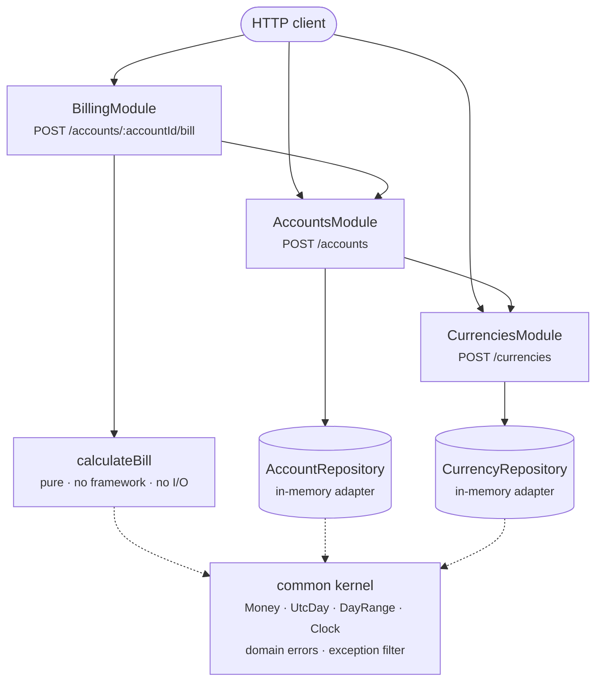
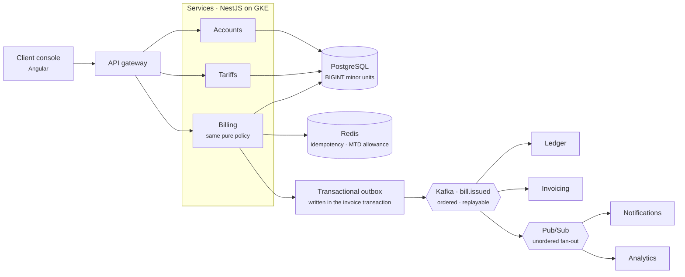

# Design notes and trade-offs

This is the thinking behind the code. How I read the brief, the places where the brief genuinely
does not tell you what to do and what I picked in each case, the things I chose not to build, and
what I would build instead if this were heading for production.

Read more about the decisions behind it:

- [Current architecture](#current-architecture)
- [The architecture I would have built for
  production](#the-architecture-i-would-have-built-for-production)
- [How I read the brief](#how-i-read-the-brief)
- [What the brief leaves open](#what-the-brief-leaves-open)
- [The decisions I expect to be questioned](#the-decisions-i-expect-to-be-questioned)
- [What I deliberately did not build](#what-i-deliberately-did-not-build)
- [Patterns I used, and the ones I stayed away
  from](#patterns-i-used-and-the-ones-i-stayed-away-from)
- [Known weaknesses in what I built](#known-weaknesses-in-what-i-built)
- [What I would do next](#what-i-would-do-next-in-order)

## Current architecture

It is a **modular monolith** built on **ports and adapters**, with **DDD tactical patterns** in the
domain and the billing rules isolated as a **pure function**. One process, three feature modules
sitting on a shared kernel, and the dependencies all pointing the same way.

Naming it matters more than drawing it, because a diagram shows you the shape while a name tells you
which rules I was holding myself to. Ports and adapters is the one doing the work here. The domain
says what it needs, infrastructure says how, and the arrow only ever points inward.

I should say what it is not as well. It is not Clean Architecture, because there are no use case
classes and no request model per use case, and it is not full DDD, because there are no bounded
contexts and no aggregate consistency rules. It has the dependency rule and it has the tactical
patterns. Claiming the rest would just invite you to ask me where my interactors are.

Rendered copy: [docs/architecture-current.png](docs/architecture-current.png)

`BillingModule` depends on the other two and neither one depends back, so there are no cycles
anywhere. Services are the public face of a module while repositories stay private to whoever owns
them, which keeps persistence from ever becoming a shared contract. The calculation itself sits
right at the bottom with no dependencies at all and that is exactly what lets you test it to death
without HTTP and without mocks.

## The architecture I would have built for production

Given what the product actually is, an accounts and payments platform settling fiat and crypto, this
is the shape I would argue for. The domain model does not change. What changes is that the seams I
left in the code, which I go through further down, turn into real boundaries.

| | | |
|:--:|:--:|:--|
|  | **Angular** | Client console. Talks to the API gateway only and never to a service directly. |
|  | **NestJS** | Same framework, several deployables. Billing keeps the pure policy function as it is. |
|  | **PostgreSQL** | Tariffs, accounts and issued invoices. Amounts as `BIGINT` minor units and never `FLOAT`. |
|  | **Kafka** | The ledger stream. Billing publishes `bill.issued` and everyone downstream consumes rather than calling back. |
|  | **Google Pub/Sub** | Fan-out for notifications and analytics, where order does not matter and managed beats operated. |
|  | **Redis** | Idempotency keys and the month-to-date transaction allowance counter. |
|  | **GKE** | Runtime, with a readiness probe which checks real dependencies instead of a static `ok`. |
|  | **Docker** | Already here. Multi-stage build, non-root, `TZ=UTC` pinned. |
|  | **GitLab CI** | Lint, typecheck, unit, integration and contract stages gating the image build. |
|  | **Terraform** | Topics, subscriptions, database and cluster as code you can review. |

Rendered copy: [docs/architecture-target.png](docs/architecture-target.png)

Three things in that diagram are the whole point of it.

The **transactional outbox** is there because writing an invoice to Postgres and publishing an event
about that invoice are two operations which must never be allowed to disagree. You write the event
into the same database transaction as the invoice and relay it separately, and that is what makes it
safe. Publish straight from the request handler and sooner or later you get invoices with no event
and events with no invoice, and in billing both of those are real money problems.

**Kafka and Pub/Sub are not doing the same job.** The ledger stream needs ordering and replay and
that is Kafka. Notifications and analytics need cheap fan-out and could not care less about order
and that is Pub/Sub. Pick one for both and you either pay for guarantees you do not need or go
without the ones you do.

**Redis holds the allowance counter**, which closes a real gap I go through further down.

## How I read the brief

The brief asks for one service and three endpoints and tells you a database is not required. The
rules it describes are a monthly base fee, a fee for every transaction above a threshold, and a
percentage discount for a number of days after an account is created.

Taken at face value that is not much code. Nearly all of the difficulty sits in the parts the brief
leaves open, and most of those only show themselves once you sit down to write a test. So that is
where I put the effort. Pin down every undefined rule, write it down, then cover it.

I also went in believing the interesting risk in a billing service is never the happy path. It is
arithmetic which is wrong in the fourth decimal place and says nothing about it, a date which means
something different depending on which machine you deployed to, and a breakdown which does not add
up to the total printed right next to it. Those three things are what I built the design around.

## What the brief leaves open

Nine rules are genuinely undefined. Guessing without saying so would have been the wrong move, so
each one is decided, written into the README and covered by a test.

**The base fee is described as belonging to the account, yet it is defined on the currency.** `POST
/accounts` has no fee field on it while `POST /currencies` has `monthlyFeeGbp`. So the fee is really
a property of a tariff and an account inherits it through its currency. I modelled `Currency` as
that tariff rather than as a currency in the FX sense, because that is what it actually is here.
Everything is billed in GBP and there is no conversion happening anywhere.

**Nothing puts a price on a transaction.** The account gives you a `transactionThreshold` but
neither payload tells you what an excess transaction costs, which means the service as written
cannot work out its own second rule. I added `transactionFeeGbp` as an *optional* field on `POST
/currencies` which falls back to a configured default. The two field payload from the brief still
works untouched, and that matters because you are going to paste it in exactly as it appears.

**"Exceeds a threshold" can be read two ways.** Either you charge for the transactions sitting above
the threshold, or you charge for all of them the moment the threshold is broken. I read "exceeds" as
the excess only.

**A monthly fee has to cover any date range you throw at it.** The bill endpoint takes any start and
any end, and nothing tells you what ten days or three months should cost. I prorate per calendar
month so every month the period touches only bills for the slice of itself you used. That is more
work than charging one flat fee, but a flat fee bills ninety days the same as it bills five and that
is hard to defend in a service whose entire job is being right about money.

**The threshold is monthly too** and it has the same problem. I scale it by the same figure which
scales the fee, so the fee and the allowance can never disagree about how long the period was.

**The discount has no defined scope.** Does it come off the base fee alone or the whole bill, and
what happens when the promotion only covers part of the period? I take it off the subtotal and
prorate it by the days the promotion and the billing period have in common. A promotion which
expires on day two of a month has no business discounting the whole month.

**`discountRate` has no unit.** Ten percent could reasonably be `10` or `0.1`. I took the
percentage, validated it to 0 through 100 and hold it internally as basis points so the arithmetic
never leaves the integers.

**The account payload has no creation date** and yet the discount is defined relative to it. So it
has to come from the server clock, which makes the third headline feature impossible to test unless
that clock is injectable. That is the entire reason `Clock` exists.

**The period end is neither inclusive nor exclusive.** That one deserves its own section below.

## The decisions I expect to be questioned

### Half-open periods

A period includes its start day and stops before its end day. That is standard interval notation,
written `[start, end)`, and it is the same rule as `range(0, 5)` in Python or a `daterange` in
Postgres, where `[)` is the default. The last value marks the boundary rather than the last item.

This is the decision I expect you to question first, because billing 2026-01-01 to 2026-01-31 gives
you £29.03 rather than £30.00 and at a glance that looks like a bug.

Here is the reasoning. A billing run does not price one period in isolation, it walks forward, and
the natural way to walk forward is to take the period you have just billed and use its end as the
next period's start. Half open survives that. January runs 1 January to 1 February and comes to 31
days, February runs 1 February to 1 March and comes to 28, which is 59 days altogether and exactly
the span from 1 January to 1 March. Nothing is billed twice and nothing is skipped. Chain an
inclusive end the same way and the 31st of January is the end of one period and the start of the
next, so it gets charged twice.

There are two smaller reasons on top of that. The length of a period becomes a plain subtraction
rather than a subtraction and a plus one, and that plus one is where off by one errors live. And an
empty period can be expressed at all: `[x, x)` is zero days, while `[x, x]` is one day and gives you
no way to say nothing happened.

Being inclusive also gets awkward the moment a timestamp is involved, because including
`2026-02-01T00:00:00Z` means including one extra instant, and an instant is not a thing you can
bill.

I want to be straight about this though. **Inclusive is a perfectly defensible choice** and plenty
of billing systems use it. It is not wrong, it is a different convention, and what actually matters
is picking one and holding it everywhere. I picked half open for the chaining property above. What I
owed you either way was to say which one I picked and why, rather than leaving you to work it out
from a figure.

So I stated the convention early in the README, made every example end on the first of a month so
the obvious reading gives round numbers, and named a test after the £29.03 case so it reads as a
decision rather than a defect.

### Integer pence, and integer month fractions

Money is an integer number of pence. Nobody in payments is going to argue with that one.

The month fraction being an integer is the part which needs explaining. The obvious way to do it is
to add the months up as a float and then call `Math.ceil(threshold * months)`, and there is a real
bug hiding in there. Take the period 1 March to 4 April 2024. The fraction is `31/31 + 3/30` which
should be exactly `1.1`. In IEEE 754 `100 * 1.1` comes out as `110.00000000000001`, so `ceil` gives
you 111 and your customer walks away with a free transaction they never earned. I swept twelve
thousand random period and threshold combinations and the float version disagrees with exact
arithmetic about one time in fifteen hundred.

One in fifteen hundred bills being wrong by a single transaction is exactly the sort of thing which
turns into a reconciliation ticket six months down the line and then eats a week of somebody's time.
So month fractions add up as integers scaled by `lcm(28, 29, 30, 31) = 377580`, which divides evenly
into every possible month length. The bug is not unlikely any more, it is impossible to represent,
and that March period has a regression test named after it.

Rounding happens exactly twice on a bill, once on the base fee and once on the discount, and both
are half up. The total is then the difference between two integers which are already rounded, so
`baseFee + transactionFees − discount === total` holds as an identity. A breakdown which does not
add up to its own total is indefensible on an invoice and I did not want that resting on whether I
had happened to get the rounding order right.

### Rejecting a valid ISO 8601 date

`2026-01-15T00:00:00` is a perfectly well formed ISO 8601 datetime and this service answers it with
a 400.

That is on purpose. A datetime with no offset gets parsed in the *server's* local zone while a plain
date gets parsed as UTC. My machine sits on UTC+2, so that string resolves to UTC day **14** January
here and to the 15th on a UTC CI runner. The same request would give you two different bills
depending on where the thing happened to be deployed, and nothing in the response would ever tell
you it had happened.

Rejecting it turns a silent environment dependent wrong answer into a loud documented one. Send a
date or send an instant with an offset on it. Internally every date is an integer UTC epoch day, so
daylight saving is not something this code has to get right, it is something this code cannot
express in the first place.

### Not validating currency codes against ISO 4217

The obvious move is `@IsISO4217CurrencyCode()` and it would throw out `USDT`, `USDC` and `BTC`,
which for BCB is plainly the wrong answer. It also argues with the endpoint itself, because if the
service already knew every valid currency then `POST /currencies` would have nothing to do.

### 422 for an unregistered currency

Opening an account against a currency nobody registered gives you a 422 rather than a 400 or a 404.
The payload itself is fine so a 400 would bury it among the schema errors, and a 404 reads like you
asked for a route which does not exist. A 400 is defensible and I would not fight you very hard on
it, but it should be a decision rather than an accident, so here it is written down.

## What I deliberately did not build

The role talks about microservices, Kafka or Pub/Sub, Postgres, Angular and GKE. None of that is in
this repository and that is a choice rather than something I forgot.

An event bus needs somebody publishing and somebody subscribing. This service is a synchronous
calculator with three endpoints and not one asynchronous boundary in it, so a broker would sit there
carrying nothing. Splitting three endpoints across microservices buys you network hops and
deployment surface for a problem which has neither. And a database is explicitly not required, so
adding one only means you need Docker and a running Postgres before you can watch a single test go
green.

What I did instead was leave the seams where those things would slot in, so the argument gets made
in code rather than in prose:

- Repositories are abstract classes used as injection tokens with in-memory adapters bound in each
  module. Swapping in Postgres is one line per module and no business logic moves.
- Both repository methods are already asynchronous, so nothing needs rewriting the day they start
  doing real I/O.
- The billing rules are a pure function which imports nothing from NestJS. If this ever became a
  worker pulling off a queue instead of an HTTP handler, that function walks across untouched.
- Domain errors carry a code and know nothing about HTTP, so a different transport only needs a new
  mapping at the edge.

## Patterns I used, and the ones I stayed away from

Every row below is something you can check in the code rather than take on trust.

| Pattern | Where it is |
| ------- | ----------- |
| Ports and adapters | `AccountRepository`, `CurrencyRepository` and `Clock` are abstract classes; the in-memory classes implement them |
| Dependency injection | Every collaborator arrives through a constructor. There is no container reach-in anywhere |
| Repository | A collection of valid domain objects. It stores and finds, it does not decide |
| Value object | `Money`, `UtcDay`, `DayRange` and `MonthFraction`, all frozen, all guarding their own rules |
| Entity | `Account` and `Currency`, which derive what they can and freeze the rest |
| Static factory | `Money.fromGbp`, `BillingPeriod.create` and `UtcDay.fromIsoString` are the only ways in, so an invalid one cannot be built |
| Explicit mapper | `toBillResponse` and friends, so the wire shape and the domain shape can move apart |
| Centralised error translation | One filter turns any failure into one envelope |

The list I care about more is the one below, because avoiding something is a decision and using
something often is not.

| What I stayed away from | How you can tell |
| ----------------------- | ---------------- |
| Anemic domain model | The usual NestJS shape, where entities are bags of public fields and every rule lives in a service. Seven files here call `Object.freeze` and the rules sit with the data |
| Fat controller | Every controller is a delegate and a map. There is no branching in any of them |
| Primitive obsession | Money is not a number, a date is not a `Date`, and a rate is not a float |
| Floating point money | Integer pence, integer month fractions, integer basis points. The one place a float appears it is rejected unless it is exact |
| Leaky abstraction | Domain errors carry a code and not a status. Nothing in the domain imports `HttpStatus` |
| Service locator | No `moduleRef.get` anywhere. If a class needs something it asks in its constructor |
| Temporal coupling | No `new Date()` in a business rule, which is the only reason the discount can be tested at all |
| Speculative generality | No broker, no database and no microservices because a job advert mentioned them |
| Exception swallowing | One filter and three try/catch blocks, each with the reason written next to it |
| Domain objects on the wire | Mappers everywhere, so renaming a private field is not a breaking change for a client |

## Known weaknesses in what I built

These all follow from decisions I made on purpose, and I would rather list them than have you find
them.

**The prorated allowance can be gamed.** A one day period with a threshold of 100 grants you four
free transactions, so billing January as thirty-one separate daily requests grants you 124 free
transactions rather than 100. That is baked into recomputing the allowance from whatever period the
caller hands you. The fix is to stop recomputing it and keep a persisted month-to-date counter which
gets decremented as transactions land, which is the Redis box in the production diagram at the top.

**The total does not always grow with the period.** Give it a small base fee and an expensive
transaction fee and a longer period can round the allowance up by more than the extra base fee is
worth, so the bill actually drops. This comes from prorating an allowance at all rather than from
the rounding I chose. There is a test pinning it so it cannot change without somebody noticing.

**Transactions are assumed to be evenly spread.** The endpoint takes a single count, so when the
discount gets prorated across the period there is no way to know when any of those transactions
really happened. Five hundred on day one and five hundred on day sixty give you the same bill.
Per-transaction records take the guess away entirely and that is the honest fix rather than a
cleverer formula.

**The discount works in days while the base fee works in month fractions.** Strictly those are
different denominators. They agree exactly whenever the period sits inside one calendar month, which
covers the overwhelming majority of bills, and they only drift apart on straddling periods by around
fifteen pence on a sixty pound invoice. The exact fix is to apportion each component on its own
basis and add two discounts together. I judged that extra complexity to be worse than the error
since the promotion is sold to the customer in days, but it is a fair thing to disagree with me on.

**The base fee is not clipped to the account's creation date even though the discount is.** Open an
account on 31 January, bill the whole of January and you pay for a full month. I kept it that way so
historical periods stay billable and the service stays easy to demonstrate. Production would clip
both and turn away any period which starts before the account existed.

**Tariffs cannot change once registered.** Fixing the fees at registration is what makes a bill
reproducible, but real pricing moves over time. The proper model is effective-dated rates where a
bill picks the rate in force for each day of the period. That is a schema change rather than a logic
change, which is part of why I was comfortable leaving it for later.

## What I would do next, in order

1. Postgres behind the repository ports which are already there, with amounts as `BIGINT` minor
units.
2. Persisted invoices with idempotency keys, so asking twice gives you back the original bill rather
than working out a fresh one.
3. Effective-dated tariffs.
4. Per-transaction records to replace the count and retire the even distribution assumption.
5. The month-to-date allowance counter, which closes the proration gap.
6. `bill.issued` published through a transactional outbox.
7. Readiness probes which check something real, and shipping the logs somewhere they can
   be searched.
The request logging and correlation ids are in place already; what is missing is a JSON transport
and somewhere to send it.

That order is deliberate. Every item on it is either a correctness fix or the thing a correctness
fix depends on. The message broker comes last because it adds the most operational surface and the
least correctness.
